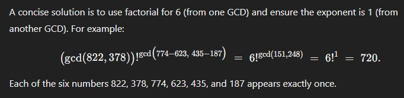
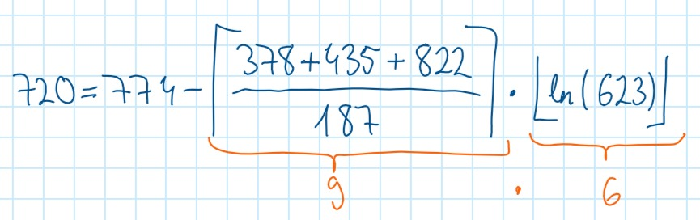

# Second Run, 17.01.2026  
  
Ein Jahr nach dem ersten Test (s.u.) mit diesem eigentlich einfachen Problem machte ich einen zweiten Versuch, dieses Mal etwas klarer formuliert (hoffe ich). Vor allem hat mich interessiert, wie Mistral Le Chat hier performt, weil das aktuell die wohl viel versprechendste europäische Alternative zu den US-Anbietern und Deepseek ist.    
  
> Here's a simple math problem. Given are six three-digit numbers 187, 623, 435, 822, 774, and 378. With these numbers and    arbitrary mathematical operators, create the number 720. Each number must be used exactly once. Find the shortest and most elegant solution. 
  
Die Musterlösung ist wie zuvor  
  
> (|{187, 623, 435, 822, 774, 378}|)! = 6! = 720
  
D.h. die Mächtigkeit der Menge fakultiert ergibt 720, egal welche Zahlen (oder Objekte) man nimmt. Tatsächlich sind das Zufallszahlen, aber es hätten auch Pokémons sein können.

Hier die jeweiligen Chats. 

  * [ChatGPT Go](https://chatgpt.com/share/696b56de-f978-8001-a24a-9ff3419eb863)
  * [Claude Sonnet 4.5](https://claude.ai/share/abeb0be8-7f8f-4b6a-af7c-50ddbd5d9699)
  * [Deepseek](https://chat.deepseek.com/share/3chjabmdz5gn7j61nn)
  * [Deepseek DeepThink](https://chat.deepseek.com/share/beicx8agh608mpwrtx)
  * [Google Gemini (Pro)](https://gemini.google.com/share/3ef4f8260541)
  * [Mistral AI, Le Chat](https://chat.mistral.ai/chat/4c89bc48-7aca-4078-8769-07777e452c1a)
  
ChatGPT Go und Claude gaben irgendwann auf und baten um die Lösung. Deepseek gab einfach auf. 

Deepseek Deepthink konnte man wie üblich beim "Denken" zusehen (dabei jede Menge extra CO2 erzeugend). Verhedderte sich aber genau so in den Grundrechenarten wie die anderen und kam nach etwa 10 Minuten mit einer Fantasielösung.   

Gemini Fast scheiterte ebenso, und versuchte mir im Brustton der Überzeugung eine offentlich falsche Rechnung unterzujubeln:  (822+774+187)-(623+435+378) = 6, dann 6! = 720. Den Chat habe ich aber versehentlich gelöscht, sorry. 

Google Gemini Pro kam nach ca. 5 Minuten auf eine wunderbar kurze und ziemlich elegante Idee ohne Mengenlehre, verletzte aber die Vorgabe, jede Zahl genau einmal zu verwenden. 

Mistral Le Chat verhedderte sich ungezählte Male in derselben Schleife und lief offenbar irgendwann auf einen Timeout. 

Effektiv probierten die meisten einfach nur mit den Zahlen herum und übersahen, dass Mathematik ein bißchen mehr ist als die Grundrechenarten. Einige fragten sogar nach, ob sie auch die Fakultät benutzen dürften - was ist an "arbitary math operators" nicht zu verstehen? Aber das ist genau, was man oft auf High-School-Level als "Math Quiz" findet und womit die LLMs vermutlich trainiert wurden. Was wenig über Mathematik sagt, aber eine Menge über High-School-Level und die Qualität von beliebig im Netz gescrapten Trainingsdaten.
  
Am Ende verriet ich die Lösung, um die Reaktionen zu testen. Was bringt diese Denkmaschinen dazu, mir stolz meine Lösung zu erklären, und dann teilweise auch noch falsch? Ein einfaches "OMG was bin ich blöd" hätte ja gereicht. 

Ich vermute, wenn die LLMs in ihren internen Matrizen einmal auf der Schiene number juggling sind, womit sie alle fast instantan anfangen, kommen sie während dieser Session nicht mehr heraus. Ganz extrem hierbei DeepThink und LeChat, wobei Deepthink ein paar interessante Ideen hatte. 
  
Beim Planeten möchte ich mich für die sinnlosen 47 kg zusätzliches CO2 entschuldigen. 

# Kleine Mathe-Challenge, 30.01.2025

Folgende Aufgabe habe ich an ChatGPT 4o and DeepSeek V3 gestellt. Beide sind krachend gescheitert. Das war aber zu erwarten, weil es sich um allgemein trainierte LLMs handelt, die nicht auf "reasoning" ausgelegt sind. Möglicherweise sind ChatGPT o3 und DeepSeek R1 besser - auf die habe ich aber keinen Zugriff. Anfrage läuft. 

Here's a simple math problem. Given are six three-digit numbers 187, 623, 435, 822, 774, and 378. With these and only these numbers used once and arbitrary mathematical operators, create the number 720. 

Diese Aufgabe habe ich in die Jahrgangs-Physik-Gruppe und in Gruppe mit Master-EI-Studierenden gestellt, weil ich mal wissen wollte, wer schneller auf die kürzeste und einfachste Lösung kommt. OK, statistisch fragwürdig weil kleine Stichprobe und so, aber als Indikation vielleicht ganz interessant. 

ChatGPT 4o kam mir mit [dieser Lösung](https://chatgpt.com/share/6799fd15-a76c-8001-897e-536bc0b49ab5). Die 560 kommt ganz nach dem Spruch meines ehemaligen Mathe-Profs Dr. Pilzweger "eine starke Behauptung ersetzt einen schwachen Beweis".   
  
DeepSeek V3 versuchte sich [so](DeepSeek.md). Man sieht, wie er nachdenkt. Aber er kommt auch nicht drauf, mal abgesehen davon, dass er sich die Zahlen 151 und 248 ausgedacht oder zumindest nicht begründet hat. Also so ähnlich wie ChatGPT. 

Aus der Runde meiner Mitstudierenden kamen folgende interessante Vorschläge, auf die ich nicht gekommen wäre. 

ChatGPT o1 versuchte es mit einem brute force Ansatz, der rechnerisch stimmt und sogar noch etwas einfacher geht. 

nämlich so:   
  
    >>> factorial(gcd(822,378))**gcd(774-623,435-187)
    720

Folgende Lösung finde ich (soweit es mir überhaupt zusteht, das so zu sagen) sehr clever:   
  

Oder diese:   
  
    >>> factorial(factorial(int(((sqrt((435-378)-(822-774))))))) + floor(187/623)
    720

Der zweite Summand ist natürlich eine null. OK.   
  
Alternativ sowas:   
  
    >>> factorial(factorial(ceil(187/387)+ceil(435/623)+ceil(774/822)))
    720

Stimmt rechnerisch und finde ich bewundernswert, aber da wollte ich nicht hin, vor allem nicht mit den LLMs. 

Habe dann doch noch selber gesehen, dass man ja auch DeepSeek R1 im Testmodus nutzen kann, und es ist lustig zuzusehen, wie er das [entwickelt](DeepSeek-R1.md). Ob das Geplappere wirklich weniger Energie braucht als die bisherigen LLMs?

## Lösung

OK, lösen wir das mal auf. Inspiriert dazu hat mich die Denksportaufgabe [Sechs Nullen wachsen über sich hinaus](https://www.spiegel.de/karriere/raetsel-der-woche-sechs-nullen-wachsen-ueber-sich-hinaus-a-68661c8e-1f19-4e82-ab9e-72d56359b6de). 
Die Musterlösung ist zwar richtig, fand ich aber wegen des Kunstgriffes 0! = 1 unbefriedigend. OK, mann muss drauf kommen, dass 720 = 6! und dass 0! = 1 ist. Und dann kam mir der Gedanke: 

    (|{0, 0, 0, 0, 0, 0}|)! = 6! = 720

Das funktioniert natürlich mit sechs beliebigen Zahlen mit jeweils beliebig vielen Stellen, oder allgemein mit sechs beliebigen Objekten in einer Menge. Die in der Aufgabe genannten Zahlen habe ich pseudozufällig ausgewählt. Reine Ablenkung. Und richtig, die LLMs (um die ging es mir) versuchten sich wie gezeigt an wilden Rechnereien mit den Grundrechenarten. Zugegeben (das habe ich auch als Feedback bekommen) war die Aufgabe sehr "sloppy" gestellt. Wie sich herausstellt, kann man mit brute force alle möglichen rechnerischen Kombinationen finden, die in Richtung Ergebnis gehen. Mir ging es aber darum heraus zu finden, ob die LLMs "out of the box" denken und auf die genannte kürzeste (eleganteste) Lösung kommen. Leider: Fehlanzeige. Vielleicht probiere ich es mit den Nullen nochmal. 
  
Die Aktion hier erhebt natürlich überhaupt keinen Anspruch auf statistische Relevanz - dazu war schon die Stichprobe zu klein, und freiwillige Teilnahme ist ja auch immer so eine Sache. Es ist also nur eine Momentaufnahme. 
  
Ich hoffe, dass mir die Aufgabenstellung nicht als Hochnäsigkeit ausgelegt wird, aber ich fand die Frage spannend, welche Lösungsansätze kommen würden, und habe selber eine Menge gelernt. Vor allem beim Programmieren in Python und C nutze ich ChatGPT viel und reichlich (für einen Moment den CO2-Footprint ignorierend), und wenn man mal gelernt hat, brauchbare Informationen von BS zu unterscheiden, ist das in diesem Bereich ein nützliches Werkzeug.
  
Der Weg zur AGI (artificial general intelligence) scheint mir aber noch weit. 

Den Teilnehmenden sei vielen Dank fürs Mitmachen! :-) 

